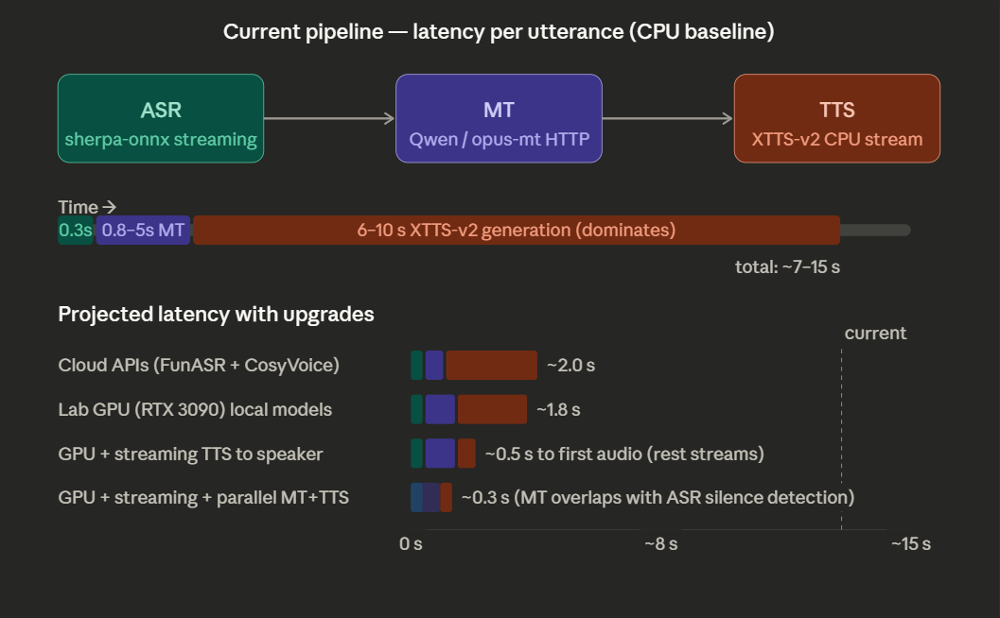

# ASR -> MT -> TTS Pipeline

一个本地实时语音链路项目，整体流程是：

`麦克风输入 -> ASR 识别 -> MT 翻译 -> TTS 播报`

当前这套实现偏向本地 CPU 可运行、调试信息清楚、结构简单，适合继续迭代。

## Features

- 实时语音识别：使用 `sherpa-onnx` 的流式 Zipformer ASR
- 语音活动检测：使用 `Silero VAD`
- 降噪：使用 `RNNoise`
- 翻译服务：使用 `FastAPI` 提供 `/translate`
- 文本转语音：支持 `XTTS v2`、`OpenVoice v2`、`edge-tts`
- 语音克隆：可读取 `voice_samples/my_voice.wav` 作为参考音频
- 串行 TTS 队列：避免后一条播报打断前一条
- 详细日志：方便确认当前到底选中了哪个模型、设备和运行模式

## Current Default Stack

按当前代码默认配置，项目实际使用的是：

- ASR: `models/zipformer`
- VAD: `snakers4/silero-vad`
- Denoiser: `RNNoise`
- MT: `Helsinki-NLP/opus-mt-zh-en`
- TTS backend: `xtts`
- TTS model: `tts_models/multilingual/multi-dataset/xtts_v2`
- Voice reference: `voice_samples/my_voice.wav`

## Project Structure

```text
files/
├─ orchestrator.py      # 主流程入口：ASR -> MT -> TTS
├─ main.py              # TTS 模块，支持 XTTS / OpenVoice / edge-tts
├─ api.py               # FastAPI 翻译服务
├─ translator.py        # 翻译模型封装
├─ record_voice.py      # 录制语音克隆参考音频
├─ test.py              # 简单的 ASR 模型检查脚本
├─ requirements.txt
├─ models/
│  ├─ zipformer/        # ASR 模型
│  └─ ...               # 其它模型目录
├─ voice_samples/
│  └─ my_voice.wav      # 默认参考音频
└─ clients/             # 历史遗留客户端代码
```

## How It Works

### 1. ASR

[`orchestrator.py`](/C:/Users/30909/Desktop/document/files/orchestrator.py) 使用流式 `Zipformer` 模型持续接收麦克风音频。

- `RNNoise` 先做轻量降噪
- `Silero VAD` 判断是否有人声
- 静音持续一段时间后，把当前识别结果视为一句完整语句

### 2. MT

识别结果会通过 HTTP POST 发给 [`api.py`](/C:/Users/30909/Desktop/document/files/api.py)：

- 默认地址：`http://127.0.0.1:8000/translate`
- 默认语言方向：`zh -> en`

翻译实际由 [`translator.py`](/C:/Users/30909/Desktop/document/files/translator.py) 完成。

当前默认：

- `USE_OPUS_MT = True`
- 使用 `Helsinki-NLP/opus-mt-zh-en`

如果改成 `False`，则会切到本地 Qwen 翻译模型。

### 3. TTS

翻译后的文本会进入 [`orchestrator.py`](/C:/Users/30909/Desktop/document/files/orchestrator.py) 里的串行 TTS 队列：

- 新句子先入队
- 后台 worker 逐条播放
- 避免多个 TTS 任务并发抢占音频设备

[`main.py`](/C:/Users/30909/Desktop/document/files/main.py) 负责真正的语音合成。

当前默认：

- `TTS_BACKEND = "xtts"`
- 参考音频：`voice_samples/my_voice.wav`

## Setup

建议使用 Python 3.10 虚拟环境。

### 1. Install dependencies

```powershell
pip install -r requirements.txt
```

如果你需要更完整的 MT/TTS 支持，可能还需要按具体后端安装附加依赖：

- XTTS:

```powershell
pip install TTS
```

- OpenVoice:

```powershell
pip install git+https://github.com/myshell-ai/OpenVoice
```

- edge-tts:

```powershell
pip install edge-tts
```

- opus-mt:

```powershell
pip install sentencepiece sacremoses
```

## Start Order

推荐按这个顺序启动。

### Terminal 1: translation API

```powershell
uvicorn api:app --host 127.0.0.1 --port 8000
```

### Terminal 2: main pipeline

```powershell
python orchestrator.py
```

如果你只想单独测试 TTS，也可以直接运行：

```powershell
python main.py
```

不过当前主流程默认是直接从 `orchestrator.py` 调用 `main.py` 的 `speak()`，不依赖 Redis 才能播报。

## Voice Cloning

如果你想让 TTS 尽量接近你的声音，先录一段干净的参考音频：

```powershell
python record_voice.py
```

默认输出：

```text
voice_samples/my_voice.wav
```

建议参考音频：

- 10 到 30 秒
- 单人说话
- 环境安静
- 不要有背景音乐、回声、削波
- 尽量和目标输出语言一致

注意：

- XTTS 是 zero-shot voice cloning，不是 100% 完全复制
- 它更像是在模仿参考音频里的说话人特征
- 如果你用男声录一个女声参考，输出通常也会更接近那段女声

## Key Configuration

### TTS

在 [`main.py`](/C:/Users/30909/Desktop/document/files/main.py) 中：

```python
TTS_BACKEND = "xtts"
VOICE_SAMPLE = "voice_samples/my_voice.wav"
PROXY = None
```

XTTS 相关参数：

```python
XTTS_TEMPERATURE = 1.0
XTTS_SPEED = 1.0
XTTS_REPETITION_PENALTY = 10.0
XTTS_LENGTH_PENALTY = 1.0
XTTS_TOP_K = 50
XTTS_TOP_P = 0.85
XTTS_STREAMING_MODE = "auto"
```

含义简述：

- `VOICE_SAMPLE`: 最影响音色像不像
- `XTTS_SPEED`: 影响语速，也会影响主观听感
- `XTTS_TEMPERATURE`: 影响自然度和随机性
- `XTTS_STREAMING_MODE`:
  - `"auto"`: GPU 时优先流式，CPU 时优先整句播放
  - `"on"`: 强制流式
  - `"off"`: 强制非流式

### MT

在 [`translator.py`](/C:/Users/30909/Desktop/document/files/translator.py) 中：

```python
USE_OPUS_MT = True
```

- `True`: 更适合 CPU，速度快
- `False`: 切到 Qwen，本地泛化能力更强，但通常更慢

### Pipeline

在 [`orchestrator.py`](/C:/Users/30909/Desktop/document/files/orchestrator.py) 中：

```python
MT_SOURCE_LANG = "zh"
MT_TARGET_LANG = "en"
VAD_THRESHOLD = 0.40
MAX_SILENCE_FRAMES = 30
```

## Typical Logs

启动后你通常会看到类似日志：

```text
[TTS] INFO  TTS config | backend=xtts | voice_sample=voice_samples/my_voice.wav
[ASR choice] tokens=... | encoder=... | decoder=... | joiner=...
[MT request] url=http://127.0.0.1:8000/translate | source=zh | target=en
[TTS dispatch] queued | lang=en | queue_size=1 | text=...
[TTS worker] dequeued | lang=en | pending_after_get=0 | text=...
```

这些日志可以帮助你确认：

- 当前用的是哪个 TTS backend
- 当前用的是哪个 ASR 模型
- MT 请求发往哪里
- TTS 是不是正在排队播放

## Notes

- 当前 TTS 队列是串行的，所以后一条播报会等待前一条播完
- 在 CPU 上，XTTS 通常会优先使用整句合成后播放，声音更连贯
- 如果你觉得“音色不像”，不一定是模型用错，更常见是参考音频质量、跨语言输出、或者 zero-shot cloning 本身的上限
- `clients/` 目录目前不是主流程核心

## Troubleshooting

### No translation response

确认翻译服务是否已经启动：

```powershell
uvicorn api:app --host 127.0.0.1 --port 8000
```

### Voice not similar enough

优先检查：

- `voice_samples/my_voice.wav` 是否真的是你想要模仿的声音
- 参考音频是否足够干净
- 是否存在“中文参考，英文输出”的跨语言情况

### TTS sounds choppy

如果是 CPU：

- 保持 `XTTS_STREAMING_MODE = "auto"` 或 `"off"`
- 不要强制流式

### Wrong audio device

可以先用：

```powershell
python record_voice.py --list-devices
```

查看可用输入设备。

## Next Ideas

后续如果继续优化，这几个方向最值得做：

- 增加自动化 TTS 质量评分
- 为 TTS 增加更明确的 speaker embedding 成功日志
- 增加配置文件而不是直接改 Python 常量
- 给前端或桌面界面做一个简单控制面板
